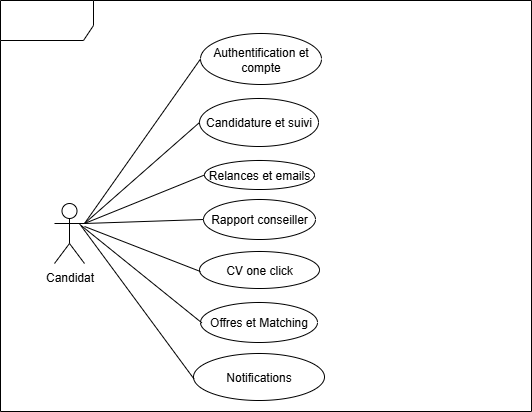
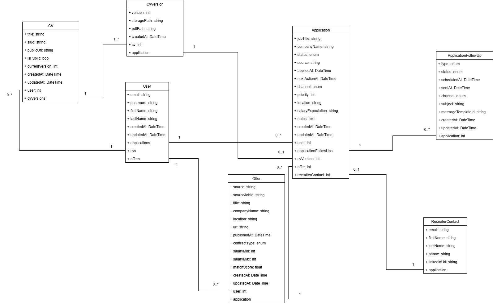

[](https://github.com/Adrien1988/recherche-emploi/actions/workflows/ci.yml)
[](https://github.com/Adrien1988/recherche-emploi/actions/workflows/deploy.yml)
[](https://github.com/Adrien1988/recherche-emploi/security/dependabot)


# Recherche d’emploi – Suivi, relances et rapports en un seul outil

**Recherche d’emploi** est une application tout-en-un pour :

- centraliser le suivi de toutes tes candidatures ;
- envoyer automatiquement des relances aux recruteurs ;
- agréger chaque jour les offres pertinentes depuis APEC, Indeed, LinkedIn, etc. ;
- générer en un clic un PDF de justificatif conforme aux exigences France Travail.

Consulte la vision produit complète pour comprendre le « pourquoi » et les objectifs : [VISION.md](./VISION.md).

---

## Documentation et diagrammes

Afin de faciliter la compréhension du système et la communication avec les conseillers ou développeurs, plusieurs diagrammes UML sont maintenus dans le dossier [`docs/Diagrammes`](docs/Diagrammes).

### Cas d’utilisation

Ce diagramme illustre les interactions principales de l’acteur **Candidat** avec le système :




## Diagramme de classes (domaine)

Le diagramme UML des entités clés (User, Application, Reminder, CV, CvVersion, Offer, RecruiterContact) et leurs relations :



Ce diagramme affiche les **attributs principaux** et les **cardinalités** pour clarifier l’architecture métier avant implémentation.

### À venir
D’autres diagrammes (séquences, classes, déploiement) pourront être ajoutés au fur et à mesure des features pour compléter la documentation technique et fonctionnelle.


## Démarrage rapide (Docker Compose)

> Prérequis : Docker ≥ 24 + GNU Make (ex. Docker Desktop + WSL 2 sous Windows 11).

Copiez-collez **l’intégralité** du bloc ci-dessous dans votre terminal – tout sera prêt en une seule exécution :

# 1· Cloner le dépôt
```bash
git clone https://github.com/Adrien1988/recherche-emploi.git
cd recherche-emploi
```
# 2· Copier les variables d'environnement (local)
```bash
cp .env.dist .env
```
# 3· Démarrer la stack conteneurisée (PHP-FPM 8.3, Nginx 1.27, MySQL 8.4)
```bash
make up
```

# 4· Ouvrir l'application dans le navigateur
#    (la page d’accueil Symfony affichera HTTP 200 dès que le code sera installé)
xdg-open http://localhost:8000 2>/dev/null || open http://localhost:8000 || start http://localhost:8000

## Base de données & migrations

# 1· Démarrer (auto-migration)
```bash
make up
```
Le conteneur php exécute automatiquement : 
composer install
php bin/console doctrine:migrations:migrate --no-interaction

# 2· Vérifier que la migration a tourné
```bash
docker compose logs php | grep -E "Migrating|Successfully migrated"
```

# 3· Lancer manuellement (optionnel)
```bash
docker compose exec php php bin/console doctrine:migrations:migrate --no-interaction
```

# 4· Accéder à phpMyAdmin (dev)
- URL : http://localhost:8080

- Identifiants : ceux de votre .env (ex. app / ******)

- Base : app

# 5· Réinitialiser complètement la BDD (dev)
```bash
make db-reset
```
Cette commande exécute un docker compose down -v puis relance la stack ; l’entrypoint rejoue les migrations et recrée les tables (user, doctrine_migration_versions, …).

## Commandes utiles (Makefile)
up:         # build & start (copie .env.dist -> .env s'il manque)
down:       # stop & remove volumes (-v)
logs:       # logs suivis (--tail=100)
test:       # lance la suite de tests (APP_ENV=test)
db-reset:   # reset complet de la base puis relance
lint:       # vérifie le style (ECS) + l'analyse statique (PHPStan)
lint-fix:   # corrige automatiquement les erreurs ECS


Exemples : 

make logs
make down
make test


## Exécution des tests

Le projet utilise **PHPUnit** via le bridge Symfony.  
La base de tests est une **SQLite en mémoire** : aucune dépendance
supplémentaire n’est nécessaire.

```bash
# Lancer l’ensemble de la suite
docker compose exec -e APP_ENV=test -w /var/www/app php vendor/bin/simple-phpunit -v
# ou simplement
make test
```

## Qualité & hooks Git

- Lint PHP : EasyCodingStandard (config `ecs.php` à la racine)
- Analyse statique : PHPStan (config `app/phpstan.dist.neon`, extensions Doctrine)
- Hook `pre-commit` : exécute ECS puis PHPStan et **refuse** le commit si le lint échoue.

Installation locale des hooks :
docker compose exec -w /var/www php php app/vendor/bin/captainhook install -c /var/www/captainhook.json --only-enabled

Commandes utiles :
make lint
make lint-fix
make test


## Statut

Projet en développement : dépôts, CI et fondations sont en place : [Definition of Done](./docs/DoD.md). Les premières fonctionnalités arrivent bientôt.

## Licence

Code sous licence MIT – voir `LICENSE` pour les détails.
